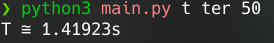

# Perildo de Ocilação
Calcula o perildo de ocilação de um pêndulo


### T - Tempo

### L - Comprimento da corda

### g - Aceleração Gravitacional 
- Sol:      g = 274,13 m/s²
- Mercúrio: g = 3,78 m/s²
- Venus:    g = 8,60 m/s²
- Terra:    g = 9,8 m/s²
- Marte:    g = 3,72 m/s²
- Júpiter:  g = 24,8 m/s²
- Saturno:  g = 10,5 m/s²
- Urano:    g = 8,5 m/s²
- Netuno:   g = 10,8 m/s²
- Plutão:   g = 5,88 m/s²
- Lua:      g = 1,67 m/s²
---

## Use:
```
run.py [calculo] [astro] [base]
```
### Calculo
t - tempo de ocilação

c - comprimento do pêndulo

### Astro
sol - Sol

mer - Mercúrio

ven - Venus

ter - Terra

mar - Marte

jup - Júpiter

sat - Saturno

ura - Urano

net - Netuno

plu - Plutão

lua - Lua

### Base
Comprimento da corda em centímetros para retornar o tempo de ocilação.

Tempo de ocilação em segundos para retornar o comprimento da corda.

## Ex:
```
run.py t ter 50
```
> Calcula o tempo de ocilação (em segundos) na terra com base no comprimento da corda (em centímetros)



